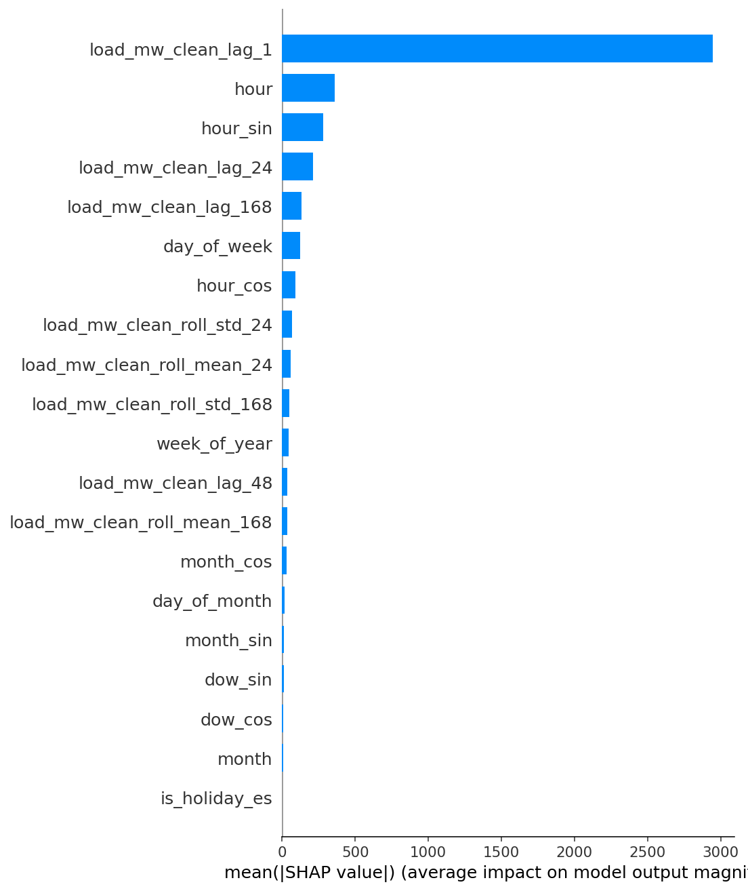
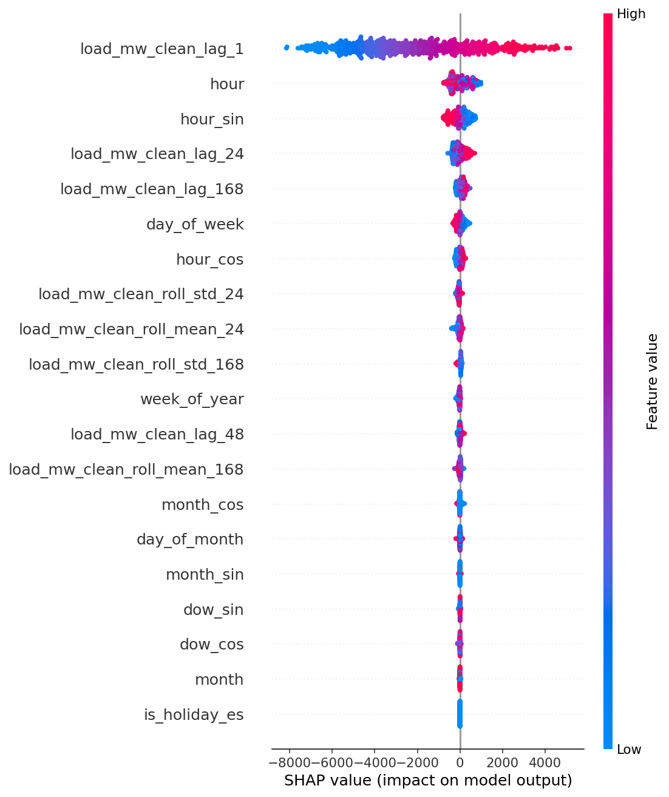
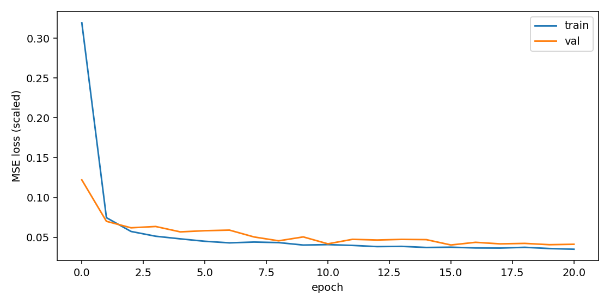
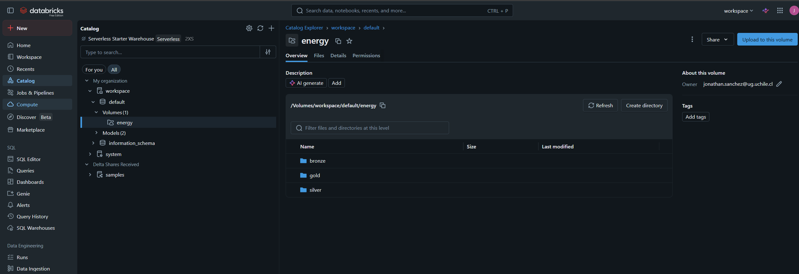
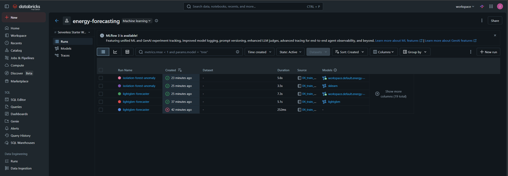
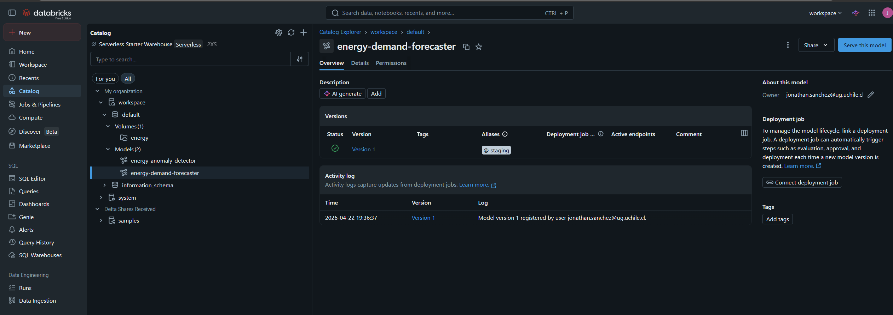

🌐 [English](README.md) · **Español**

# ⚡ Forecasting de Demanda Eléctrica en Tiempo Real y Detección de Anomalías

> **Pipeline MLOps production-grade sobre Databricks con arquitectura Medallion, registro de modelos en MLflow y monitoreo de drift.**

Plataforma de datos end-to-end que ingesta datos de demanda eléctrica desde la [ENTSO-E Transparency Platform](https://transparency.entsoe.eu/) (o EIA Open Data para EE.UU.), los transforma mediante una arquitectura **Bronze → Silver → Gold** (Medallion) en Delta Lake, entrena modelos de forecasting (LightGBM + Prophet + LSTM) y detección de anomalías (Isolation Forest), los trackea en MLflow, y sirve predicciones a través de un microservicio FastAPI con un dashboard Streamlit encima.

---

## 🏗️ Arquitectura

```
┌────────────────────┐     ┌──────────────────┐     ┌──────────────────┐
│   ENTSO-E / EIA    │────▶│  Bronze (Delta)  │────▶│  Silver (Delta)  │
│  (15 min / horas)  │     │   raw, append    │     │  limpiado, tipado│
└────────────────────┘     └──────────────────┘     └────────┬─────────┘
                                                             │
                                                             ▼
        ┌─────────────────────────┐              ┌───────────────────────┐
        │  Streamlit Dashboard    │◀─────────────│   Gold (Delta)        │
        │  (forecast + anomalías) │              │   features + target   │
        └────────────┬────────────┘              └──────────┬────────────┘
                     │                                      │
                     │ HTTPS                                ▼
                     ▼                         ┌───────────────────────┐
        ┌─────────────────────────┐            │   MLflow Tracking     │
        │    Servicio FastAPI     │◀───────────│   + Model Registry    │
        │  (Dockerized, /predict) │            └───────────┬───────────┘
        └─────────────────────────┘                        │
                     ▲                                     ▼
                     │                         ┌───────────────────────┐
                     └─────────────────────────│  Evidently AI         │
                                               │  (monitoreo de drift) │
                                               └───────────────────────┘
```

---

## 🎯 Qué demuestra este proyecto

| Capacidad | Evidencia |
|---|---|
| **Data engineering en la nube** | Arquitectura Medallion (Bronze/Silver/Gold) con tablas ACID en Delta Lake |
| **Ingestión lista para streaming** | Cargas incrementales idempotentes, schema evolution, watermarking |
| **ML productivo** | Experimentos en MLflow + Model Registry con aliases staging/production |
| **Multi-model serving** | Forecasting (LightGBM, Prophet, LSTM) + detección de anomalías (Isolation Forest) en un solo pipeline |
| **Rigor MLOps** | Tests unitarios, CI/CD, Docker, monitoreo de drift con Evidently |
| **Explicabilidad** | Valores SHAP expuestos vía API |
| **Observabilidad** | Métricas Prometheus, logging estructurado, alertas de drift |

---

## 📂 Estructura del proyecto

```
.
├── src/
│   ├── ingestion/        # Cliente ENTSO-E/EIA, loaders bronze
│   ├── transformations/  # Pipelines Bronze → Silver → Gold (PySpark)
│   ├── features/         # Feature engineering (calendario, lags, weather)
│   ├── models/           # Forecasting + detección de anomalías
│   ├── serving/          # App FastAPI
│   ├── monitoring/       # Reportes de drift con Evidently
│   └── utils/            # Logging, config, sesión Spark
├── notebooks/            # Notebooks .py exportables a Databricks (Medallion)
├── dashboards/           # App Streamlit
├── tests/                # Suite pytest
├── docker/               # Dockerfile + compose
├── configs/              # Configs YAML por ambiente
├── scripts/              # Bootstrap / scripts auxiliares
├── .github/workflows/    # Pipelines CI/CD
└── docs/                 # Decisiones de arquitectura, diagramas
```

---

## 🚀 Quickstart

### 1. Requisitos

- Python 3.11+
- Java 11 (para PySpark local)
- Un **token gratuito de ENTSO-E** → solicítalo en <https://transparency.entsoe.eu/> (Account → "Web API Security Token"), **o** un API key de EIA en <https://www.eia.gov/opendata/register.php> (instantáneo, sin aprobación)
- Docker (opcional, para serving)

### 2. Setup

```bash
python -m venv .venv
source .venv/bin/activate        # Windows: .venv\Scripts\activate
pip install -r requirements.txt
cp .env.example .env             # completar EIA_API_KEY o ENTSOE_API_TOKEN
```

### 3. Correr el pipeline localmente

```bash
# 1. Ingestar data cruda → Bronze
python -m src.ingestion.run_bronze --source eia --region CAL --start 2024-04-01 --end 2026-04-22

# 2. Bronze → Silver
python -m src.transformations.run_silver

# 3. Silver → Gold (features)
python -m src.features.run_gold

# 4. Entrenar forecasting + modelos de anomalía (loguea a MLflow)
python -m src.models.train_all

# 5. Lanzar API
uvicorn src.serving.api:app --reload --port 8000

# 6. Lanzar dashboard
streamlit run dashboards/app.py
```

### 4. Deploy en Databricks

Los notebooks en `notebooks/` usan el formato Databricks `# COMMAND ----------` — impórtalos directamente a un workspace Databricks (funciona en Free Edition con Unity Catalog).

---

## 🧪 Testing

```bash
pytest tests/ -v --cov=src --cov-report=term-missing
```

---

## 📊 Resultados — 2 años de data CAISO (2024-04-08 → 2026-04-22)

**Dataset:** 17,854 observaciones horarias de demanda de la red de California obtenidas desde EIA Open Data.
**Ventana de test:** 30 días holdout (718 horas).

### Forecasting — MAPE en 30 días de test (menor es mejor)

| Modelo                       | Familia            | MAPE      | RMSE (MW) | MAE (MW) | Notas |
|------------------------------|--------------------|-----------|-----------|----------|-------|
| **LightGBM** (ganador)       | Gradient boosting  | **1.81%** | **700**   | **533**  | Promovido a `@staging` |
| LSTM (PyTorch, ventana 168h) | Deep learning      | 2.84%     | 1,053     | 817      | 2 capas, 64 hidden, 30 epochs CPU |
| Prophet                      | Estadística Bayes. | _omitido_ | —         | —        | `cmdstan` requiere MinGW en Windows |

LightGBM gana cómodamente — es lo esperable para features tabulares bien diseñadas sobre data horaria. El LSTM es un runner-up respetable y cerraría la brecha con tuning de hiperparámetros (secuencias más largas, hidden size mayor, attention heads).

### Detección de anomalías

| Modelo           | Anomalías detectadas | Tasa   | Rango del score    |
|------------------|----------------------|--------|--------------------|
| Isolation Forest | 179 / 17,854         | 1.00%  | -0.08 → 0.24       |

### Explicabilidad (SHAP sobre el ganador LightGBM)

El modelo LightGBM viene con artefactos SHAP logueados en MLflow (`shap/shap_bar.png`, `shap/shap_beeswarm.png`, `shap/shap_values.csv`) para que cualquier consumidor del modelo pueda ver qué features dominan las predicciones.

| Mean |SHAP| (importancia global) | Distribución del impacto por feature |
|---|---|
|  |  |

Los top drivers son los lags recientes de carga (`load_mw_clean_lag_1`, `load_mw_clean_lag_24`) y las codificaciones cíclicas de calendario (`hour_sin`, `hour_cos`), coherente con que la demanda eléctrica está dominada por estacionalidad diurnal + semanal más persistencia.

### Curva de entrenamiento LSTM



La pérdida de validación se aplana alrededor del epoch 10; el early stopping (patience=5) corta poco después.

---

## 🏗️ Corriendo en Databricks (Free Edition + Unity Catalog)

El mismo código corre end-to-end en Databricks Free Edition contra un workspace con **Unity Catalog** — Bronze/Silver/Gold como tablas Delta dentro de un volumen UC, experimentos MLflow trackeados a nivel workspace, y el modelo ganador promovido al Unity Catalog Model Registry con el alias `@staging`.

Benchmark sobre **400 días de data CAISO horaria** traída fresca desde Databricks:

| Métrica | Pipeline local | Databricks Free Edition |
|---|---|---|
| LightGBM MAPE | **1.81 %** | **1.83 %** |
| LightGBM RMSE (MW) | 700 | 705 |
| Tasa de anomalía Isolation Forest | 1.00 % | 1.01 % |

Resultados prácticamente idénticos entre ambientes — el pipeline es reproducible y portable, no atado al ambiente.

### Volumen Unity Catalog (Bronze / Silver / Gold como Delta)



Las capas Medallion viven bajo `workspace.default.energy/` como volumen gestionado por UC, heredando gobernanza, lineage y control de acceso a nivel workspace — sin necesidad de DBFS root.

### Experimento MLflow — runs + métricas



Cada run de entrenamiento loguea params, métricas y el artefacto de modelo firmado. Los runs `lightgbm-forecaster` e `isolation-forest-anomaly` se comparan lado a lado.

### Model Registry en Unity Catalog — alias `@staging`



`workspace.default.energy-demand-forecaster` versión 1 lleva el alias `@staging` con su signature completa de input/output, listo para ser servido vía Databricks Model Serving o consumido por el microservicio local FastAPI vía `models:/...@staging`.

---

## 📸 Capturas de la UI (stack local)

| Dashboard Streamlit | Experimentos MLflow |
|---|---|
|  |  |
| _17.8k registros, duck curve de California._ | _Runs de LightGBM + LSTM lado a lado con métricas y artefactos SHAP._ |

---

## 📜 Licencia

MIT
